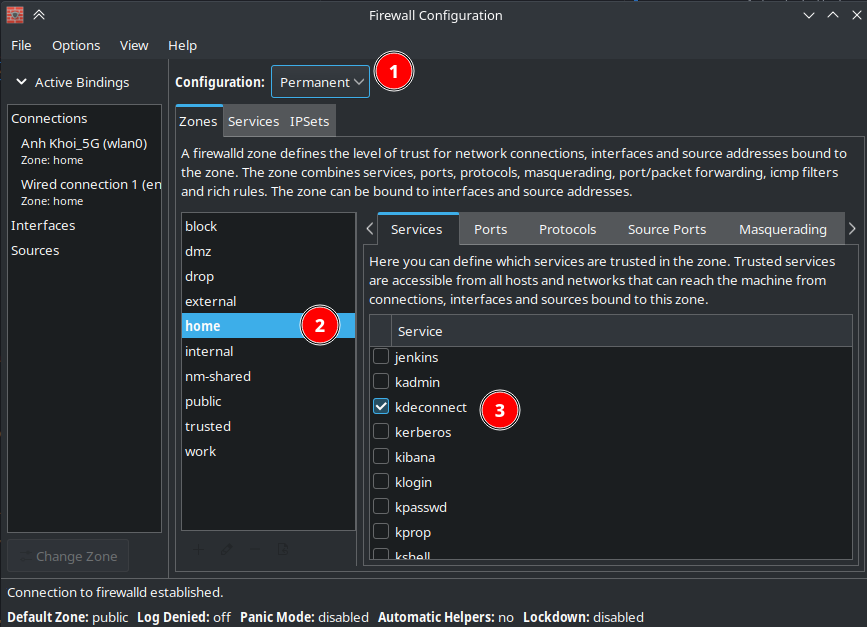

# dotfiles

Personal Linux dotfiles.

## KDE Arch Linux

### Setup - Arch X11

```bash
sudo pacman -S ansible

cd arch-ansible
ansible-playbook playbook.yaml --ask-become-pass -i hosts -v

cd ..
sh _archRestore
```

### Backup and Sync

```bash
# Setup for Arch
$ sh ./archBackup
```

---

## KDE Arch Linux

### Manual Instructions

1.  Install and Apply Kwin Scripts:

    a. Sticky Window Snapping

    b. Latte Window Colors (Unnecessary)

    c. Force Blur (Unnecessary)

2.  Open autostart and Set:

    a. !! Buggy 13-12-2023 !! Easystroke (If on KDE X11)

3.  Not include any Look and Feel customizations

    a. Plasma style: Future-dark

    b. Window Decorations: No border (Window border size) + No titlebar button tooltips (checkbox)

    c. Fonts: SF UI Display + SF Mono

    d. Icons: Reversal-blue + HandMade_Notion_Icons

        Follow Paths.txt instructions in ~/Packages/HandMade_Notion_Icons

    e. Cursors: BreezeX-Black

    f. GitHub repos: WhiteSur-kde, WhiteSur-icon-theme, McMojave-cursors, moe-theme

6.  !! Buggy 13-12-2023 !! Configure gestures Touche - Touchegg

7.  If KDE connect is working, allow its service to be trusted.



### Not Installed

1. ttf-google-fonts-git, ttf-mac-fonts for additional fonts
2. scrcpy for Android app development
3. CiscoPacketTracer for Computer Networking Sim
4. kvantum-qt5 for Look and Feel customization
5. minecraft-server for joy :>
6. applet-window-appmenu for window appmenu (GitHub Repo)
7. applet-window-buttons for window buttons (GitHub Repo)
8. Yin-Yang for Yin Yang (GitHub Repo)
